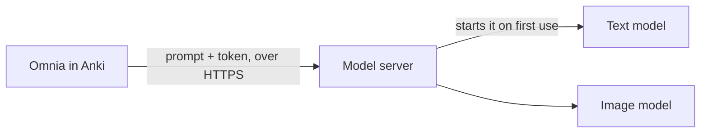

# Self-hosted models

Omnia can write and illustrate your cards with models running on a machine you control (a GPU
server, or your own Mac or PC) instead of a paid API. To Omnia, such a server is one more
endpoint: an address, a token, and the models it lists.

## How it works

1. When a field is generated, Omnia sends its prompt, built from your note, to the server
   together with your token.
2. The server turns away any request without a valid token before a model is touched.
3. If the model is not running, the server starts it. That first answer takes a minute or two;
   the ones after it are quick.
4. After a stretch with no requests (30 minutes by default) the server stops the model and gives
   its GPU or memory back.

## Connect Omnia to a server

You need two things from whoever runs the server: its **address**, ending in `/v1`, and a
**token**.

1. *Tools → Omnia* → **Smart Notes** → *Configure…* → **⚙ Options** → **Usage & Keys** →
   **🔑 Keys**.
2. Type a name for the endpoint (for example `my-gpu-box`) and press **Add endpoint**.
3. On its card, fill in **Base URL** (the address) and **API key** (the token).
4. Press **↻ Load models**. The **Text model** and **Image model** boxes now offer the models
   the server lists; pick one for each. Leave **Image model** empty if the server has none.
   Press **Save**.
5. Open the **Text** tab next to **🔑 Keys** (or **Image**), set **Default model** to your
   endpoint and its model, type a prompt under **Test playground** and press **Run test**. An
   answer means it works.

Every field left on *(inherit)* now uses the endpoint. To use it for some fields only, pick it
in those rows of the Fields table instead.

The token is what grants access, so keep it to yourself. If someone else needs access, they
should get their own token, which can then be revoked without affecting yours.

## Run your own server

[omnia-llm](https://github.com/osirisQdt2810/omnia-llm) is a ready-made server for Omnia. Pick
the guide for the machine it will run on:

| Machine | Guide | What you get |
|---|---|---|
| Mac with Apple Silicon | [Mac](https://github.com/osirisQdt2810/omnia-llm/blob/main/docs/guidance/apple.md) | A small text model |
| Linux with an NVIDIA GPU | [NVIDIA](https://github.com/osirisQdt2810/omnia-llm/blob/main/docs/guidance/nvidia.md) | A text model and an image model sharing one 24 GB GPU |
| Linux with an AMD GPU | [AMD](https://github.com/osirisQdt2810/omnia-llm/blob/main/docs/guidance/rocm.md) | Preview, not yet tried on AMD hardware |
| Any computer | [CPU](https://github.com/osirisQdt2810/omnia-llm/blob/main/docs/guidance/cpu.md) | A small text model |

Each guide ends with the Base URL, token and model names to enter above.

Any server that speaks the OpenAI API works too, for example Ollama, LM Studio, llama.cpp's own
server or vLLM. Use its address ending in `/v1`; if it does not use tokens, type anything as the
API key. **↻ Load models** lists its models in the same way.

## Develop and integrate

To change models, or to work on the server itself, run it on the computer you develop on:

1. Start omnia-llm there (the Mac and CPU guides take a few minutes).
2. Add an endpoint for it in Omnia as above, with its local address, for example
   `http://127.0.0.1:8731/v1` for the Mac setup.
3. After each change, restart omnia-llm, then press **↻ Load models** and **Run test** in Omnia.

Omnia needs no change, no restart and no new code for any of this: it only knows the address,
the token and the model names.

- **Change or add models:** [omnia-llm's models guide](https://github.com/osirisQdt2810/omnia-llm/blob/main/docs/guidance/models.md).
  A model you add shows up in **↻ Load models** under the name you gave it.
- **Build your own server:** [the server contract](server-contract.md) lists every request Omnia
  makes and what it expects back.

## When it fails

| You see | What it means |
|---|---|
| *invalid or missing API key* (401) | The token is wrong or was revoked; ask for a new one |
| *too many wrong tokens* (429) | Too many wrong tokens came from your address; wait 15 minutes |
| *no device has … free* (503) | Every GPU on the server is busy right now; try again later |
| The first answer takes a minute or two | The model was not running and is starting; the next answers are fast |
| **↻ Load models** says it could not load | Check the Base URL and the token. You can still type a model name into the box |
| An image field fails but text works | The endpoint has no image model: pick one under **Image model**, or use another provider for images |
