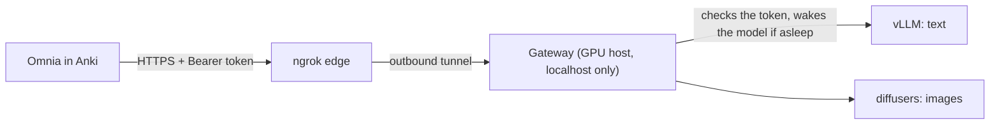

# Local server — your own models for Omnia

Omnia can generate text and images with models running on your own GPU machine instead of a
hosted API. On Omnia's side it is an ordinary custom endpoint: a URL, a token, and model names.

## Data flow



1. Omnia sends the prompt (built from your note's fields) with the token.
2. The gateway rejects anything without a valid token — before any model is touched.
3. If the model is asleep it starts it on one free GPU (the first request takes ~1.5 min), then
   answers. After 30 idle minutes it stops again and frees the GPU.
4. Nothing on the GPU host listens publicly: the ngrok agent dials out. HTTPS ends at ngrok.

## Set it up

**On the GPU host** (operator, once per user):

```bash
cd ~/workspaces/omnia-llm
.venv/bin/python generate_auth_token.py <name>      # prints a token ONCE — copy it
.venv/bin/python generate_auth_token.py --list      # who has access
.venv/bin/python generate_auth_token.py --revoke <name>   # cut someone off, immediately
```

The public URL is the ngrok domain the `omnia-llm-ngrok` service runs on.

**In Omnia** (each user): *Tools → Omnia* → **Smart Notes** → *Configure…* → **Usage & Keys** →
🔑 **Keys** → name it → **Add endpoint**, then fill in and **Save**:

| Field | Value |
|---|---|
| Base URL | `https://<your-domain>/v1` |
| API key | the token |
| Text model | `omnia-local` |
| Image model | `sdxl-turbo` |

Then **Text** tab → Default model = your endpoint → type something → **Run test**.

**Check it from a terminal:**

```bash
OMNIA_LLM_BASE=https://<your-domain> OMNIA_LLM_KEY=<token> guidance/local-server/smoke_test.sh
```

## Integrate your own server

Omnia only speaks the OpenAI API, so any server that does works — vLLM, Ollama
(`http://localhost:11434/v1`), LM Studio (`http://localhost:1234/v1`), llama.cpp's
`llama-server` (`http://localhost:8080/v1`), or your own:

| Endpoint | Needed for | Notes |
|---|---|---|
| `POST /v1/chat/completions` | text fields (required) | `model` = the card's *Text model* |
| `POST /v1/images/generations` | image fields (optional) | Omnia sends `size: "1024x1024"`, `response_format: "b64_json"` |
| `Authorization: Bearer <key>` | every request | any non-empty key if your server has none |

The reference gateway adds a few endpoints that Omnia's own tooling uses and yours may copy:
`GET /health` (no token), `GET /status` (asleep / starting / ready, per engine), `POST /warm`
(start the model now, return at once), `POST /stop` (free the GPU now).

If your server is not on the same machine as Anki, put HTTPS and a token in front of it (ngrok,
Cloudflare Tunnel) rather than opening a port.

## When it fails

| Symptom | Meaning |
|---|---|
| `401` | Wrong or revoked token |
| `429` | Too many wrong tokens from your address — wait 15 minutes |
| `503` | No GPU is free right now — try again later |
| `502 … No space left on device` | The GPU host's disk is full |
| The first request takes ~1.5 min | The model was asleep; later ones are fast |

This repository is public: never commit a real URL or token. Keep them in Omnia's settings.
