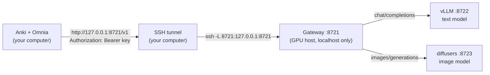

# Local server — your own GPU box serving Omnia's text and images

Omnia can generate fields with models you run yourself instead of a hosted API. On Omnia's side
this is an ordinary **custom endpoint** (Smart Notes → *Usage & Keys* → 🔑 *Keys* → *Add
endpoint*): any server that speaks the OpenAI API for `/v1/chat/completions` and
`/v1/images/generations`. This guide is about testing that path end to end, against the
reference setup below.

## How it fits together



The reference gateway is a small service on the GPU host that owns both engines:

- **Lazy.** Nothing touches a GPU until the first request. That request starts the engine it
  needs and waits for it; later ones go straight through.
- **Self-releasing.** Each engine stops after `idle_timeout_minutes` (default 30) with no
  requests, and `POST /stop` releases the card at once.
- **One card, and only a free one.** A card counts as free only with no compute process, under
  512 MiB used and under 10 % utilisation — so a colleague's job is never joined. The two engines
  share the same card; if none qualifies the gateway answers `503` with `Retry-After`.
- **Keyed.** Every route except `/health` needs `Authorization: Bearer <key>` (or `X-API-Key`),
  and an unauthenticated request can never start an engine. The key is generated by the gateway
  on first start and lives only on the GPU host.
- **Never exposed.** It binds to `127.0.0.1`; you reach it through an SSH tunnel, so no port is
  opened and Omnia's `base_url` is always localhost.

Reference models, which fit together on one 24 GB card: `Qwen/Qwen2.5-14B-Instruct-AWQ` through
vLLM for text (served as `omnia-local`), and `stabilityai/sdxl-turbo` through diffusers with CPU
offload for images. Measured together: about 13.8 GB of VRAM.

## One-time setup

All of this runs **on your computer**.

1. **An SSH alias for the GPU host** in `~/.ssh/config`, with key-based login (the tunnel runs
   unattended, so it cannot type a password):
   ```
   Host <your-host>
       HostName <address>
       Port <port>
       User <user>
   ```
2. **The tunnel.** Once, by hand:
   ```bash
   ssh -N -L 8721:127.0.0.1:8721 <your-host>
   ```
   To keep it up permanently on macOS, save this as
   `~/Library/LaunchAgents/com.omnia.llm-tunnel.plist` — replacing `YOUR-HOST` with your alias —
   and load it. `KeepAlive` restarts it when the connection drops:
   ```xml
   <?xml version="1.0" encoding="UTF-8"?>
   <!DOCTYPE plist PUBLIC "-//Apple//DTD PLIST 1.0//EN" "http://www.apple.com/DTDs/PropertyList-1.0.dtd">
   <plist version="1.0"><dict>
     <key>Label</key><string>com.omnia.llm-tunnel</string>
     <key>ProgramArguments</key><array>
       <string>/usr/bin/ssh</string><string>-N</string>
       <string>-o</string><string>ExitOnForwardFailure=yes</string>
       <string>-o</string><string>ServerAliveInterval=30</string>
       <string>-o</string><string>ServerAliveCountMax=3</string>
       <string>-o</string><string>BatchMode=yes</string>
       <string>-L</string><string>8721:127.0.0.1:8721</string>
       <string>YOUR-HOST</string>
     </array>
     <key>RunAtLoad</key><true/>
     <key>KeepAlive</key><true/>
     <key>StandardErrorPath</key><string>/tmp/omnia-llm-tunnel.log</string>
   </dict></plist>
   ```
   ```bash
   launchctl load ~/Library/LaunchAgents/com.omnia.llm-tunnel.plist
   launchctl list | grep omnia.llm        # a PID in the first column = running
   ```
3. **The key.** It stays on the GPU host; read it when you need it, never paste it into the repo:
   ```bash
   ssh <your-host> 'cat ~/workspaces/omnia-llm/api-key.txt'
   ```

## Test it, one layer at a time

Each layer only makes sense once the one before it passes, so a failure tells you where to look.
[`smoke_test.sh`](smoke_test.sh) runs layers 1–3 in one go:

```bash
OMNIA_LLM_SSH=<your-host> guidance/local-server/smoke_test.sh           # warm check
OMNIA_LLM_SSH=<your-host> guidance/local-server/smoke_test.sh --cold    # also time a cold start
OMNIA_LLM_SSH=<your-host> guidance/local-server/smoke_test.sh --stop    # release the GPU after
```

It reads the key over SSH into a private temp file and never prints it.

### 1. The tunnel and the gateway are up

```bash
curl -s http://127.0.0.1:8721/health          # -> {"ok":true}
```
No answer means the tunnel is down (see *Troubleshooting*); `/health` needs no key, so it
isolates the connection from everything else.

### 2. The key is enforced

```bash
curl -s -o /dev/null -w '%{http_code}\n' http://127.0.0.1:8721/status    # -> 401
```
Anything but `401` here is a security problem, not a convenience — stop and look.

### 3. The engines start on demand and answer

With the key in a variable (`KEY=$(ssh <your-host> 'cat ~/workspaces/omnia-llm/api-key.txt')`):

```bash
curl -s -H "Authorization: Bearer $KEY" http://127.0.0.1:8721/status | python3 -m json.tool
curl -s -H "Authorization: Bearer $KEY" -H 'Content-Type: application/json' \
  -d '{"model":"omnia-local","messages":[{"role":"user","content":"Define ephemeral in one sentence."}],"max_tokens":60}' \
  http://127.0.0.1:8721/v1/chat/completions
```
`/status` lists both engines (`running`, `gpu`, `idle_seconds`) and every card with whether it
counts as free. Expected timings, measured on the reference setup:

| Request | Warm | Cold (engines stopped) |
|---|---|---|
| Short text answer | ~0.4 s | 85–100 s — the process, CUDA, loading the weights (6 s) and engine warm-up (39 s) |
| Image, 1024×1024 (what Omnia sends) | ~7 s | ~26 s, on top of the text engine if both were stopped |

So the first generation after 30 idle minutes takes about a minute and a half, and every one after
it is fast. Image time barely depends on size: with CPU offload most of it is moving weights onto
the card, not the four denoising steps. The very first start on a new host also downloads the
weights (~16 GB), which takes as long as your link does. `smoke_test.sh --cold` measures the cold
path on your own setup.

### 4. Omnia talks to it

In Anki: *Tools → Omnia* → the **Smart Notes** tile → *Configure…* → **Usage & Keys**.

1. 🔑 **Keys** → type a name (e.g. `my-gpu`) → **Add endpoint**. A card appears at once.
2. Fill it in and press **Save**:
   | Field | Value |
   |---|---|
   | Base URL | `http://127.0.0.1:8721/v1` |
   | API key | the key from step 3 of the setup |
   | Text model | `omnia-local` |
   | Image model | `sdxl-turbo` |
3. **Text** sub-tab → Default model → provider `custom:my-gpu`, model `omnia-local` → type a
   prompt → **Run test**. A reply appears under the button.
4. **Image** sub-tab → same provider → **Run test** with a picture prompt. An image appears.

The Default model you picked is also what language detection, ✨ Auto-prompt and ✦ Improve use,
and what any field left on *(inherit)* generates with.

### 5. Real fields generate

Continue with [`../smart-notes/`](../smart-notes/README.md): point one text field and one image
field at `custom:my-gpu`, open a note, press ✨ (`Ctrl+Shift+G`), and check both fields fill.
Then run a small batch from the Browser. The Usage table should count those calls under the
endpoint's provider.

### 6. The automated checks

On your computer, in the repo's venv:

```bash
# Offline — the endpoint lifecycle, the catalog and the Keys UI (no server needed):
pytest tests/core/test_custom_endpoints.py tests/gui/test_smart_notes_dialog_deps.py -q

# Live — real calls through the tunnel:
pytest tests/providers/test_llm.py::TestOpenAICompatibleRealLLM -q
pytest tests/plugins/smart_notes/test_smart_notes.py::TestSmartNotesLLMGenReal -k openai_compatible -q
```

The live tests read the `[llm.openai_compatible]` section of the gitignored
`user_files/config/providers.toml` (or of the config directory named by `OMNIA_TEST_CONFIG`).
Give it the same four values as the card above; without them the live tests skip rather than
fail. The first live run after the engines have idled out includes a cold start.

### 7. It lets go of the GPU

- After 30 idle minutes, `/status` shows `running: false`, and the GPU host's `nvidia-smi` shows
  no `VLLM::EngineCore` process.
- `curl -s -XPOST -H "Authorization: Bearer $KEY" http://127.0.0.1:8721/stop` releases the card
  immediately — the thing to do the moment a colleague needs it.

## Operating the server

On the **GPU host**, everything lives in `~/workspaces/omnia-llm` (code, venv, logs, weights):

```bash
systemctl --user status omnia-llm           # the gateway itself (uses no GPU while idle)
systemctl --user restart omnia-llm          # after editing config.toml
journalctl --user -u omnia-llm -f           # gateway log: starts, stops, idle reaping
tail -f ~/workspaces/omnia-llm/logs/text.log   # the text engine's own log
nvidia-smi                                   # what is on each card
df -h /home                                  # free disk — see Troubleshooting
```

`config.toml` holds what you normally change: `model`, `idle_timeout_minutes`,
`gpu_memory_utilization`, `max_model_len`, `image_model`, `image_steps`. The versions are pinned
for a CUDA 12.6 driver without root: vLLM 0.16 with torch 2.9.1+cu126, and diffusers 0.35 with
transformers 4.57 — newer vLLM needs a newer torch that has no build for that driver.

## Troubleshooting

| Symptom | Cause | Fix |
|---|---|---|
| `/health` hangs or refuses | Tunnel down | `launchctl list \| grep omnia.llm`; read `/tmp/omnia-llm-tunnel.log`; `ssh <your-host>` by hand to see the real error |
| `401` | Missing or wrong key | Re-read it from the host; in Omnia re-enter it on the endpoint card and **Save** |
| `503 gpu_unavailable` | No card is free (colleagues are using them all) | Wait; the response carries `Retry-After: 120`. Nothing is broken |
| `502 local engine failed to start: [Errno 28] No space left on device` | The host's disk is full | `df -h /home` on the host; free space (e.g. `~/.cache/pip`), then retry |
| First request takes a minute or more | Cold start | Expected — 85–100 s; see the timings in layer 3 |
| `501` on images: `no image model is configured on this gateway` | `image_model` is empty in the gateway's `config.toml` | Set it and restart the gateway |
| Omnia: `OpenAI-compatible provider requires an api_key` | The endpoint card has no key, or it was cleared | Fill **API key** on the card and **Save** |
| Omnia: `Unknown llm provider 'custom:…'` | A field or the default still names an endpoint you removed | Re-pick the provider in that field, or in Default model |
| The image picker has no endpoint | The card has no **Image model** | Fill it and **Save**; both pickers refresh |

## Security checklist

- The gateway binds to localhost and is reached only through SSH; never open its port.
- `/health` is the one route without a key, and it reveals nothing (no model, no GPU, no host).
- The key lives on the GPU host and in Omnia's secrets store — never in `providers.toml`, never in
  this repository. The same goes for the host's name and address.
